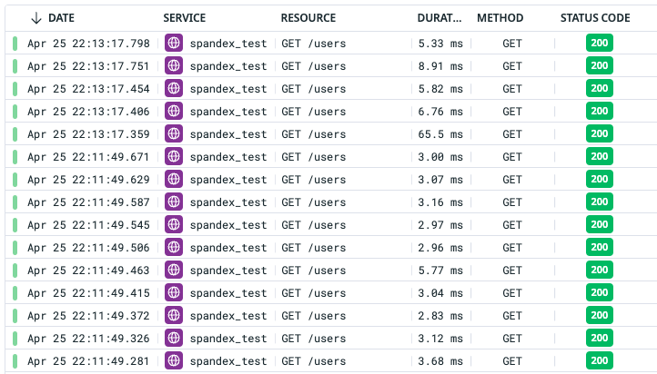
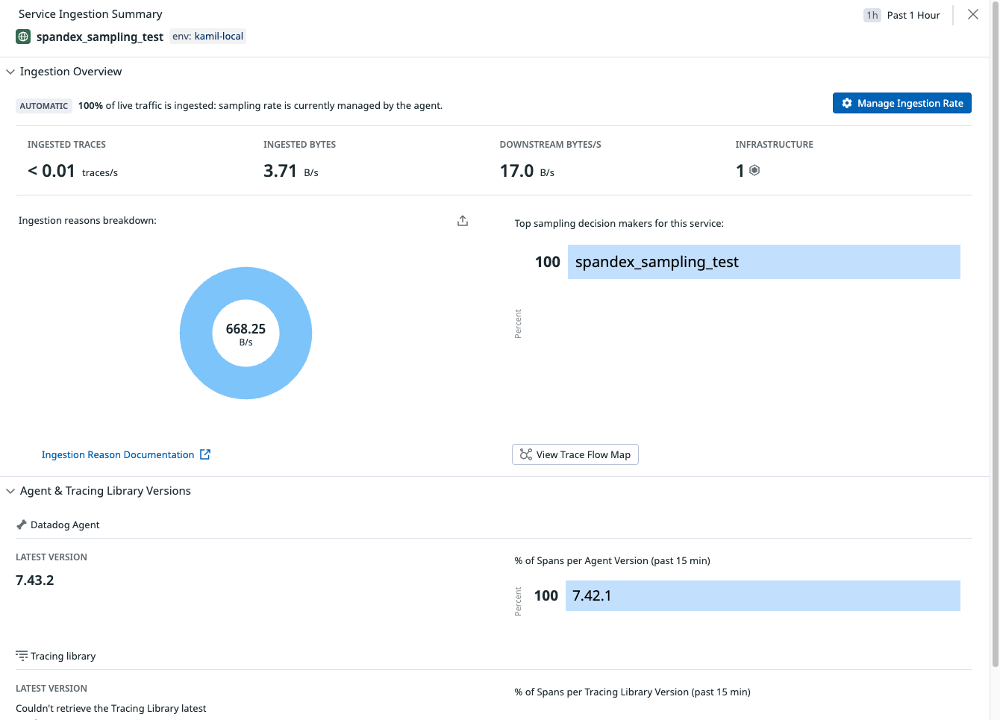

# Spandex Trace Sampling Demo

This is a repository containing a demo of trace sampling using the changes in the following two pull requests:

- https://github.com/spandex-project/spandex/pull/142
- https://github.com/spandex-project/spandex_datadog/pull/52

## Running

To run the demo you'll need Elixir and Docker Compose.

Additionally, you'll need to export a `DD_API_KEY` variable containing a Datadog API key since the demo uses a local Datadog Agent.

```sh
# Export the API key
export DD_API_KEY=<YOUR KEY HERE>

# Boot up the database and Datadog Agent
docker compose up -d

# Install deps
mix deps.get

# Setup the database
mix ecto.create && mix ecto.migrate

# Run the app
mix phx.server

# In another session, run the script that performs 10 requests to your app
./generate_traces.sh
```

## Important bits

- `SpandexTestTracer` - implements an override of priority to `manual_keep` in case of errors
- `SpandexTestSampler` - implements a plug that sets the priority based on a sampling rate

## Caveats

- `SpandexDatadog.Constants` has a bug - both `auto_keep` and `auto_reject` have the value 1
- The priority _needs_ to be set, otherwise it will be ingested with the reason `undefined`

## Results

Here's a screenshot of a simple test - generating 10 requests with both a 1.0 and 0.5 sample rate at 10:11pm and 10:13pm respectively as seen in the [Traces page in Datadog's APM](https://app.datadoghq.com/apm/traces). It seems the traces are being sampled correctly.



On the other hand, here's the screenshot of the [Ingestion Control](https://app.datadoghq.com/apm/traces/ingestion-control) page for another service, tested with 50% sampling rate. It still reports 100% ingestion rate, with the `auto` reason specified. That might be due to the library being unofficial, or some metadata still missing.


